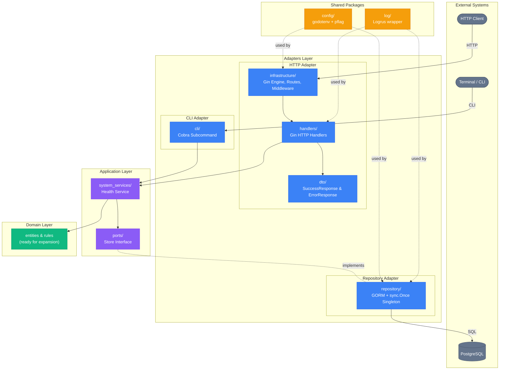
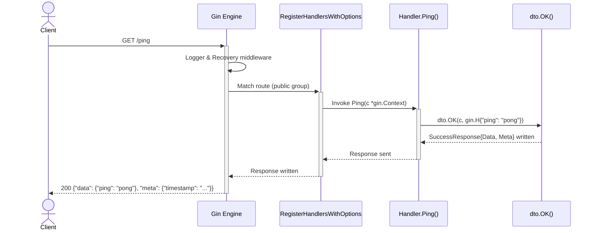
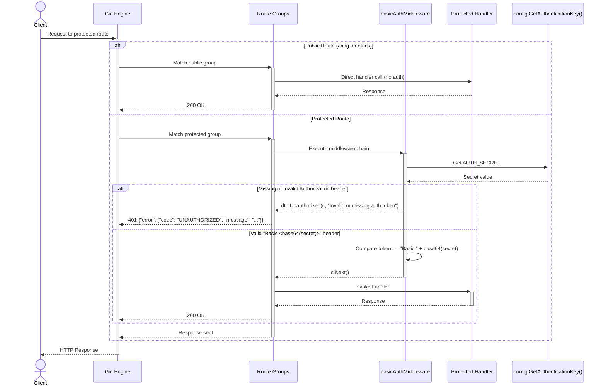
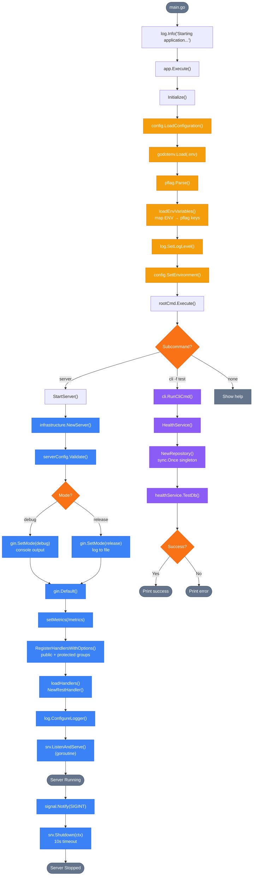
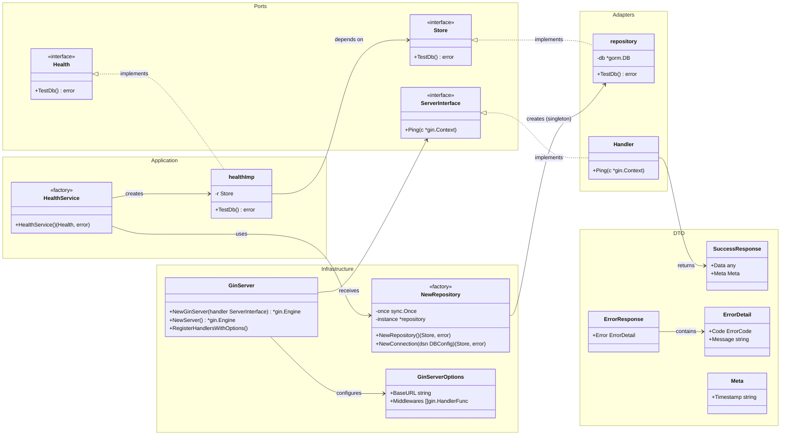

# Architecture Diagrams

Visual documentation for the API Template Gin project. All diagrams use [Mermaid](https://mermaid.js.org/) syntax and render natively on GitHub.

---

## Table of Contents

- [1. Clean Architecture Overview](#1-clean-architecture-overview)
- [2. HTTP Request Flow](#2-http-request-flow)
- [3. Authentication Middleware Flow](#3-authentication-middleware-flow)
- [4. Server Startup Sequence](#4-server-startup-sequence)
- [5. Ports & Adapters (Class Diagram)](#5-ports--adapters-class-diagram)

---

## 1. Clean Architecture Overview

Hexagonal architecture with three layers. Dependencies always point inward — adapters depend on application, application depends on domain. External systems are accessed only through port interfaces.

---

## 2. HTTP Request Flow

End-to-end flow of a `GET /ping` request through all architectural layers.

---

## 3. Authentication Middleware Flow

How the Basic Auth middleware validates requests on protected routes. Public routes bypass this entirely.

---

## 4. Server Startup Sequence

Complete initialization flow from `main.go` to a running HTTP server with graceful shutdown.

---

## 5. Ports & Adapters (Class Diagram)

Interfaces (ports) and their concrete implementations (adapters). Shows the Dependency Inversion principle — application layer defines the contracts, adapter layer implements them.

---

## Rendering

These diagrams render natively on:
- **GitHub** — Markdown preview
- **GitLab** — Markdown preview
- **VS Code** — With [Markdown Preview Mermaid](https://marketplace.visualstudio.com/items?itemName=bierner.markdown-mermaid) extension

For local editing, use the [Mermaid Live Editor](https://mermaid.live/).
